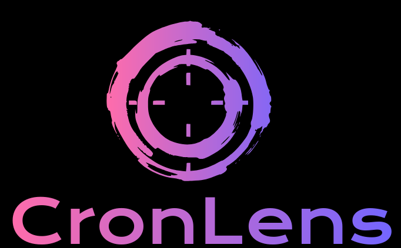
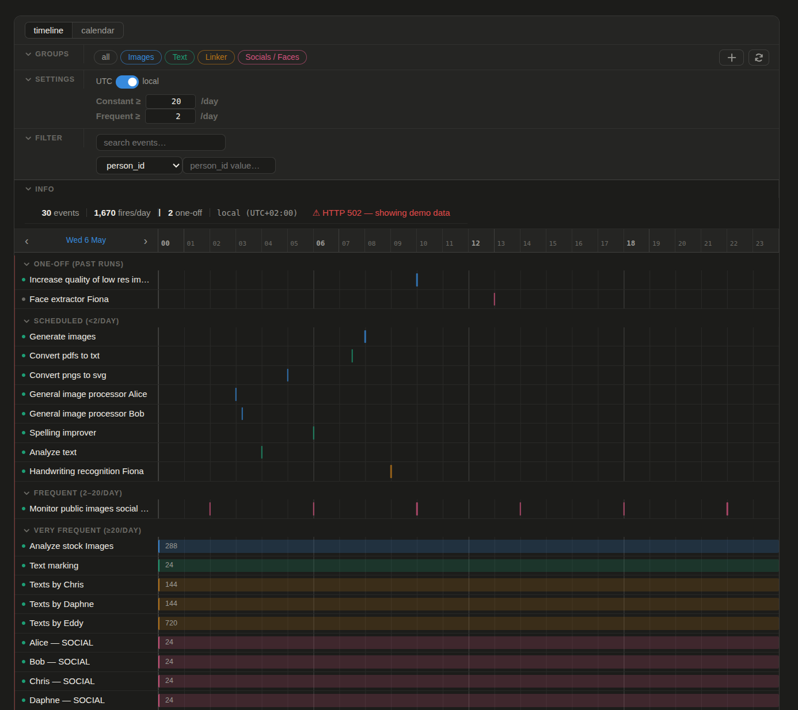
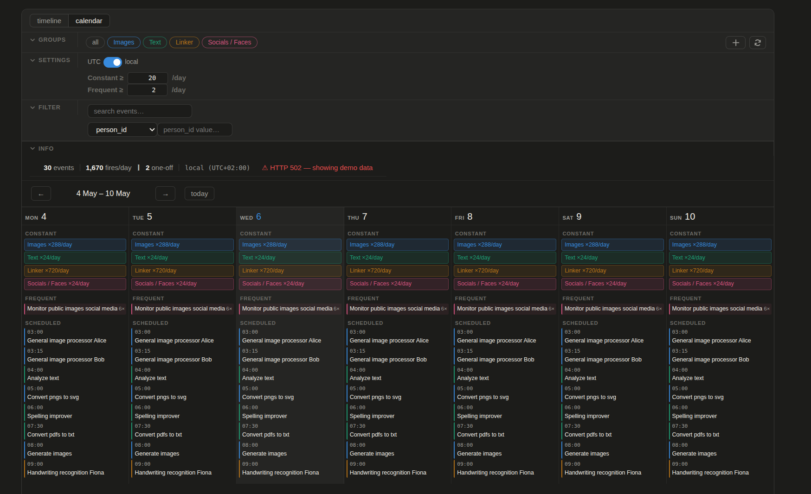

<div style="text-align: center;">
  
  <br /><br />
  <h2>Visualise periodic tasks and cronjobs as an interactive timeline and weekly calendar.</h2>
</div>

---

CronLens is a pure frontend app that can group, search and filter cronjobs and/or celery tasks and visualise their schedules as a timeline and weekly calendar.

The API contract is backend-agnostic: any scheduler (django-celery-beat, APScheduler, cron, a custom system) can implement it.

## :camera: Sneak peek
<!-- Timeline view -->
### Timeline


### Calendar
<!-- Calendar view -->


## :sparkles: Features

- :clock1: **24-hour timeline** — every task plotted at its fire times across a horizontal day view
- :calendar: **Weekly calendar** — Mon–Sun grid with per-day task breakdown
- :signal_strength: **Frequency tiers** — high-frequency tasks render as a solid band; lower-frequency tasks show individual tick marks
- :art: **Task groups** — assign tasks to named colour-coded groups by kind; persisted locally and synced to the API
- :mag: **Search and filter** — live search by name, kind or schedule; filter by group or any filterable attribute from the API
- :globe_with_meridians: **UTC / local time toggle** — switch between UTC and browser-local time in one click
- :floppy_disk: **Demo mode** — falls back to built-in sample data when the API is unreachable (development only)

## :electric_plug: Connecting your backend

CronLens expects two endpoints. The full OpenAPI spec is in [`openapi.yaml`](openapi.yaml) and the narrative spec is in [`API_CONTRACT.md`](API_CONTRACT.md).

| Method | Endpoint | Description |
|---|---|---|
| `GET` | `/api/schedule/events/` | All scheduled events with fire times and metadata |
| `GET` / `POST` | `/api/schedule/groups/` | Custom display groups |
| `PUT` / `DELETE` | `/api/schedule/groups/{id}/` | Update or delete a group |

### :gear: How the events endpoint works

The backend is responsible for expanding native schedule formats into minute-of-day integers. The frontend only renders numbers — it has no cron parser.

```json
{
  "events": [
    {
      "id": "1",
      "name": "Analyze stock images",
      "kind": "analyze_image",
      "enabled": true,
      "recurrence": "recurring",
      "fires_utc": [0, 60, 120, 180, 240, 300, 360, 420, 480, 540, 600, 660,
                    720, 780, 840, 900, 960, 1020, 1080, 1140, 1200, 1260, 1320, 1380],
      "fires_on_days": null,
      "last_run_at": "2026-05-05T08:00:00Z",
      "total_run_count": 1460,
      "schedule_display": "every hour",
      "attributes": [
        { "key": "portfolio", "value": "stock", "filterable": true }
      ]
    }
  ],
  "meta": {
    "source": "django-celery-beat",
    "generated_at": "2026-05-05T14:32:00Z"
  }
}
```

`fires_utc` contains sorted minute-of-day values (0–1439) for a 24-hour window. `fires_on_days` is `null` (fires every day) or an array of day-of-week integers (0 = Sun, 6 = Sat). `attributes` is an open list of key-value metadata — mark an attribute `filterable: true` to expose it in the filter dropdown.

### :snake: django-celery-beat adapter

A minimal adapter that maps `PeriodicTask` to the contract (see [API_CONTRACT.md](API_CONTRACT.md) for the full implementation):

```python
# views.py
from django_celery_beat.models import PeriodicTask
from django.http import JsonResponse

def events(request):
    tasks = PeriodicTask.objects.select_related("crontab", "interval", "clocked").all()
    return JsonResponse({"events": [serialize(t) for t in tasks]})
```

### :package: Other backends

Any backend works. The only requirement is that it serves the JSON shape above at `/api/schedule/events/`. APScheduler, Celery Beat on a different database, a raw crontab parser, a static JSON file — all equally valid.

## :label: Task groups

Groups map event `kind` values to a display name and colour. They are managed through the group editor in the toolbar.

Groups are stored in two places:

1. :zap: **localStorage** — written on every change, shown immediately on load
2. :cloud: **API** — fetched after the localStorage snapshot is displayed; the response overwrites localStorage

All group mutations are optimistic: the UI updates immediately and the API call happens in the background.

## :hammer_and_wrench: Local development

**Prerequisites:** Node ≥ 20, Yarn

```bash
yarn install
yarn dev          # dev server at http://localhost:5173
```

In development the Vite dev server proxies all `/api/*` requests to `http://localhost:8000`. Point this at your backend by setting `VITE_API_BASE` in the shell:

```bash
VITE_API_BASE=http://my-backend:8000 yarn dev     # run locally with a custom API base
VITE_API_BASE=http://my-backend:8000 yarn build   # production build against a remote API
yarn preview                                       # preview the production build locally
yarn lint                                          # oxlint + eslint
yarn format                                        # prettier
```

> **Split-origin setup** (frontend on a CDN, API on a separate domain): add CORS headers on the API side and set `VITE_API_BASE` at build time as shown above.